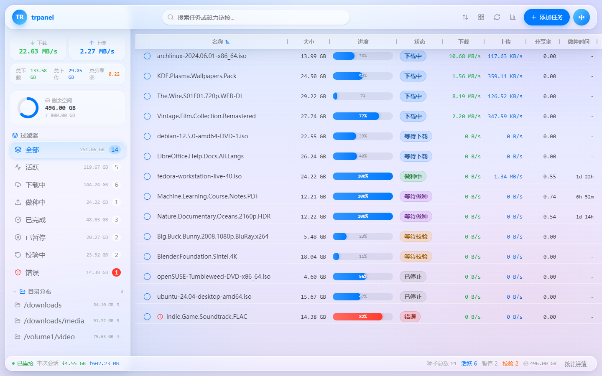
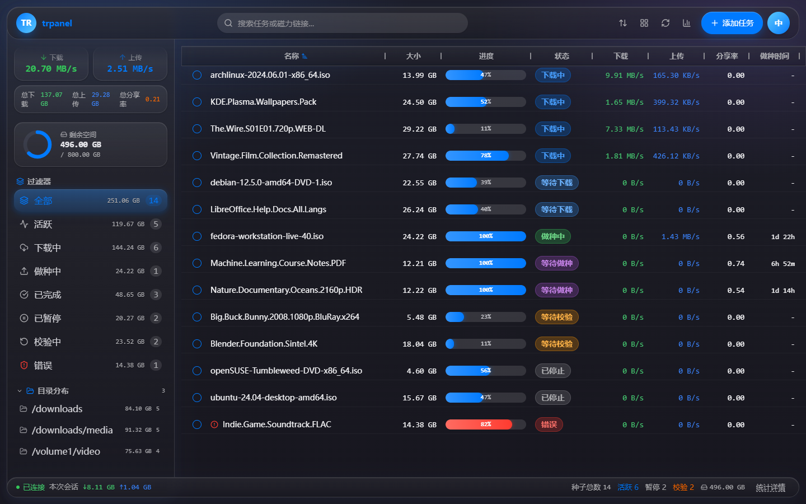
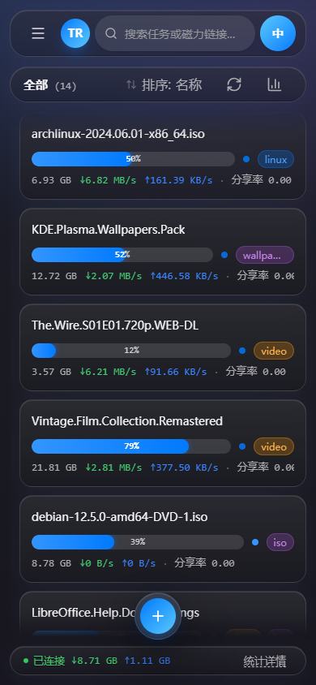

<div align="center">

# trpanel

**基于 Go + React 重构的 Transmission 现代化 Web 管理面板**
*专为飞牛 OS（fnOS）打造 · 前后端一体交付*

<br>

[](https://go.dev)
[](https://react.dev)
[]()
[]()
[](./LICENSE)
[](../../releases)
[](https://github.com/sushazhi/trpanel/pkgs/container/trpanel)
[](https://sushazhi.github.io/trpanel/)

</div>

---

## ✨ 核心功能

| | 功能 | 说明 |
|:--|:--|:--|
| 🧲 | **种子管理** | 添加（`.torrent` / 磁力 / 批量）、开始 / 暂停 / 删除、优先级、标签、队列调整，**全操作支持批量** |
| 📁 | **文件操作** | 文件树设优先级、重命名，自动重新校验；按路径添加种子受白名单保护 |
| ⚡ | **实时推送** | WebSocket 推送速度 / 进度 / Peers / Tracker 状态 / 块位图 |
| 🔍 | **模糊搜索** | 忽略大小写、空格与标点，保留字母 / 数字 / 中日韩文字，`m team` 也能命中 `M-Team` |
| 🧰 | **多维筛选 / 排序** | 状态 / 标签 / 站点 / 目录 / 错误状态 + 状态优先级 + 二级字段多级排序 |
| 🖥️ | **桌面交互** | 鼠标虚拟滚动表格 + 右键菜单 + 拖拽排序 + 可伸缩侧栏（持久化） + 表头右键管理列 |
| 📱 | **触屏交互** | 玻璃卡片列表，长按 / ⋮ 唤出菜单，左右滑切换分类，勾选进入批量，动作条"全选"补齐分组，底部悬浮胶囊承载添加 / 启停 / 清理 |
| 🌐 | **会话与全局** | 多服务器切换、全局限速、带宽定时调度、下载 / 做种队列、轮询间隔 |
| 🛠 | **工具集** | 浏览器端 `.torrent` 创建（bencode + 分片 SHA1）、按分享率 / 做种时长批量清理已完成种子 |
| 🤖 | **自动化** | 已完成种子按站点归档；**做种策略**按站点分享率 / 做种天数 / 上传量目标达标后暂停 / 删除 / 删除并清理文件 |
| 🤝 | **MCP 服务** | 内置 MCP 端点（`/mcp`），Claude / Qoder 等 AI 客户端可直接查询种子、做种策略达标报告并执行添加 / 启停操作；「设置 → 自动化 → MCP 服务」开启，独立接入令牌鉴权，删除默认关闭 |
| 📈 | **图表统计** | 速度历史曲线 + 统计仪表盘 |
| 📲 | **PWA** | 可安装、离线缓存、新版本更新提示、键盘快捷键（`N` / `Space` / `Delete` / `Ctrl+A` / `/` / `Esc` / `Ctrl±`） |
| 🎨 | **外观** | 明 / 暗主题、中 / 英文、**可调玻璃浓度**、**背景壁纸**（作为玻璃折射色源形成色彩流动） |
| 🍃 | **飞牛 OS 深度集成** | 原生文件选择器、主题 / 语言同步、"打开所在文件夹"、应用更新（fpk）、问题反馈入口 |
| 🔌 | **宿主平台抽象** | 后端 `internal/platform/` + 前端 `src/platform/`，同一套代码跑 Docker / 物理机 / fnOS，新宿主零业务改动 |

---

## 📸 预览

### 🌐 在线体验

无需安装，打开即用，数据在浏览器内模拟生成、可完整交互：

| | 地址 | 说明 |
|:--|:--|:--|
| 🖥️ | **[电脑版预览](https://sushazhi.github.io/trpanel/)** | 桌面布局：虚拟滚动表格、右键菜单、拖拽排序 |
| 📱 | **[移动版预览](https://sushazhi.github.io/trpanel/mobile.html)** | 手机壳样式的移动版预览；真机打开自动进入应用本体 |

> 演示模式为纯前端构建（`pnpm build:demo`），不连接任何后端；推送到 `master` 自动部署（[工作流](.github/workflows/demo-pages.yml)）。首次启用需在仓库 **Settings → Pages** 将 Source 设为 **GitHub Actions**。

<table align="center">
  <tr>
    <th align="center">桌面 · 浅色</th>
    <th align="center">桌面 · 深色</th>
  </tr>
  <tr>
    <td></td>
    <td></td>
  </tr>
</table>

<table align="center">
  <tr>
    <th align="center">移动端</th>
  </tr>
  <tr>
    <td align="center"></td>
  </tr>
</table>

> 截图基于内置 Transmission Mock（`./dev.ps1 -mock`）生成，14 个种子覆盖各种状态。

---

## 🚀 快速开始

> trpanel **是一个独立的 Transmission 管理面板**，需要你已有一台运行中的 Transmission（已开启 RPC）。它通过浏览器提供增强界面；**并非 Transmission 本体，也不通过 `TRANSMISSION_WEB_HOME` 替换其自带 Web 界面**。

### ✅ 前置条件

- 一台运行中的 Transmission，**已开启 RPC**（默认 `http://localhost:9091/transmission/rpc`）
- 与 Transmission 网络互通（同机 / 局域网 / 容器网络皆可）

### 🐳 方式一：Docker 部署（推荐）

```bash
docker run -d --name trpanel \
  -p 8200:8200 \
  -e TR_URL=http://host.docker.internal:9091/transmission/rpc \
  -e API_TOKEN=change-me \
  -v trpanel-data:/data \
  ghcr.io/sushazhi/trpanel:latest
```

也可以直接用仓库自带的 [`docker-compose.yml`](docker-compose.yml)：

```bash
API_TOKEN=change-me docker compose up -d
```

| 项 | 值 |
|:--|:--|
| 镜像 | `ghcr.io/sushazhi/trpanel` |
| 架构 | `linux/amd64`、`linux/arm64` |
| 标签 | `v1.2.3`（与仓库 Git 标签完全一致）、`latest`（当前最新版本的镜像） |
| 数据卷 | `/data`（即 `TM_DATA_DIR`，存放 `tm-state.json` 与界面保存的连接配置） |
| 健康检查 | `GET /` 每 30s |

> ⚠️ 容器内 `SERVER_HOST=0.0.0.0`，**未设置 `API_TOKEN` 时服务会拒绝启动**（防止局域网裸奔）；令牌在浏览器首次访问时粘贴一次即可，之后持久化在本地。
> 镜像由 [Docker 工作流](.github/workflows/docker.yml)自动构建发布：仅推送 `v*` 标签触发多架构构建；PR 只验证构建不推送。GHCR 包首次发布后需在仓库 **Packages → Package settings** 中把可见性改为 Public，才能匿名拉取。

#### 🇨🇳 国内加速拉取

`ghcr.io` 在国内直连常常很慢或超时，可把 `ghcr.io` 换成下表的加速域名，拉完再 `tag` 回原名——这样 `docker-compose.yml` 一行都不用改：

| 加速源 | 域名 | 特点 |
|:--|:--|:--|
| **南京大学开源镜像站**（首选） | `ghcr.nju.edu.cn` | 高校公益源，稳定，免注册 |
| 毫秒镜像 | `ghcr.1ms.run` | 免费公开，延迟低；节点有 IP 轮询，偶发抖动 |
| DaoCloud 公共加速 | `ghcr.m.daocloud.io` | 同时支持 dockerhub / gcr / quay，大镜像缓存稍慢 |

```bash
# 以南京大学源为例（毫秒 / DaoCloud 同理，替换域名即可）
docker pull ghcr.nju.edu.cn/sushazhi/trpanel:latest
docker tag  ghcr.nju.edu.cn/sushazhi/trpanel:latest ghcr.io/sushazhi/trpanel:latest
```

> ⚠️ **`daemon.json` 的 `registry-mirrors` 只对 `docker.io` 生效**，把上面的域名填进去**不会**加速 ghcr——Docker 客户端压根不查它（`docker info` 会显示，但拉取仍走官方源）。
> 这些源都是**缓存式**代理：刚发布的新镜像首次拉取可能报 `manifest unknown`，等缓存同步或换一个源重试即可。三方源由高校 / 社区维护，可用性会变；长期稳定方案是把镜像同步到自己的阿里云 ACR 或腾讯云 TCR。

<details>
<summary><b>containerd / K8s：域名分流（全局生效，集群适用）</b></summary>

```bash
sudo mkdir -p /etc/containerd/certs.d/ghcr.io
sudo tee /etc/containerd/certs.d/ghcr.io/hosts.toml <<'EOF'
server = "https://ghcr.io"

[host."https://ghcr.nju.edu.cn"]
  capabilities = ["pull", "resolve"]
EOF
sudo systemctl restart containerd
```

配置后集群 YAML 里的镜像地址无需改动，containerd 访问 `ghcr.io` 时自动转到加速节点。
</details>

### 📦 方式二：二进制 / 源码构建

#### 1️⃣ 获取程序

- **直接下载**：在 [Releases](../../releases) 下载 `trpanel-*.tar.gz`，解压即用
- **自行构建**：

  ```bash
  cd backend && go build -o trpanel ./cmd/server
  ```

#### 2️⃣ 配置连接

任选其一（优先级：**环境变量 > `.env.local` > `config.yaml` > 默认值**）：

<details>
<summary><b>环境变量</b>（启动前 export）</summary>

```bash
export TR_URL=http://<transmission-ip>:9091/transmission/rpc
export TR_USER=admin
export TR_PASS=password
```
</details>

<details>
<summary><b>配置文件</b>（以 <code>backend/config.example.yaml</code> 为模板）</summary>

```yaml
# backend/config.yaml
server:
  port: 8200
transmission:
  url: "http://<transmission-ip>:9091/transmission/rpc"
  username: "admin"
  password: "password"
```
</details>

<details>
<summary><b>界面设置</b>（启动后填写，热更新无需重启）</summary>

「设置」→ 连接地址 → 填写 RPC 地址 / 账号 → 保存。
</details>

#### 3️⃣ 运行

```bash
./trpanel        # Linux / macOS
trpanel.exe      # Windows
```

#### 4️⃣ 访问

浏览器打开 **`http://<服务器IP>:8200`**，连接成功后即可添加 / 管理种子。

#### 🔧 （可选）从源码构建前端并嵌入

```bash
cd frontend && pnpm install && pnpm build
cd ../backend
Copy-Item ..\frontend\dist\* web\dist\ -Recurse -Force   # PowerShell
# cp -r ../frontend/dist/* web/dist/                      # Linux/macOS
go build -o trpanel ./cmd/server
```

---

## 🛠 本地开发

项目根提供 `dev.ps1`（Windows）与 `dev.sh`（Linux/macOS）一键拉起前后端：

```bash
.\dev.ps1          # Windows：前台运行，Ctrl+C 一并退出
.\dev.ps1 -bg      # Windows：后台运行，日志写入 dev/logs/
./dev.sh           # Linux / macOS：前台运行
./dev.sh -bg       # Linux / macOS：后台运行
```

启动后：

| 服务 | 地址 |
|:--|:--|
| 前端（Vite） | http://localhost:5173（已代理 `/api`、`/ws` 到后端） |
| 后端（Go） | http://localhost:8200 |

### 🔥 热更新（默认开启）

- **前端**：Vite HMR + React Fast Refresh，保存 `.tsx` / `.ts` / CSS 即热替换，尽量保留组件状态
- **后端**：检测到 `air` 时启用 Go 热重载，保存 `.go` 自动重编译重启（前端 WebSocket 自动重连）
  ```bash
  go install github.com/air-verse/air@latest
  ```

特殊环境开关（环境变量）：

| 变量 | 作用 |
|:--|:--|
| `DEV_NO_HMR=1` | 关闭前端 HMR（内嵌 WebView 等环境会阻断 WebSocket） |
| `DEV_WATCH_POLL=1` | 文件监听改用轮询（网络盘 / 虚拟机共享目录 / WSL 挂载） |

### 📂 运行时产物

所有开发运行时产物统一写入项目根 `dev/`：

```
dev/
├── data/        # tm-state.json、界面保存的连接配置 .env.local
└── logs/        # backend.log、frontend.log、mock.log
```

> `dev/` 已在 `.gitignore` 中整体忽略。后端数据目录通过 `TM_DATA_DIR` 指向 `dev/data`；生产部署不设置时仍使用默认 `~/.trpanel`。

### 🧪 没有可用的 Transmission？用内置 Mock

仓库自带说 Transmission RPC 协议的 mock（`backend/cmd/trmock`），内置覆盖各状态的种子数据并实时推进进度 / 速度：

```bash
./dev.sh -mock       # Linux / macOS
.\dev.ps1 -mock      # Windows（mock 监听 :9092）
```

单独运行：`cd backend && go run ./cmd/trmock`（`127.0.0.1:9092`，`-h` 查看 `-seed` / `-tick` / `-static` 等选项）。

**运行时在 mock 与真实远端之间热切换**：

- 界面切换：设置 → 连接地址，填 `http://localhost:9092/transmission/rpc`（mock）或真实远端，保存即生效
- 启动时指定：`TR_URL=http://localhost:9092/transmission/rpc`

---

## 📖 使用指南

### 首次连接

1. 浏览器访问 `http://<服务器IP>:8200`（本机 `http://localhost:8200`）
2. 若 Transmission 不在本机或开启了认证，打开「设置」（桌面顶栏右侧头像菜单 / 移动侧滑抽屉底部）填写 RPC 地址、用户名、密码并保存；亦可环境变量 / `config.yaml` 预先配置
3. 连接成功后主界面实时显示速度、进度与种子列表

### 添加任务

- 点击顶栏「+」（移动端为底部悬浮胶囊的「+」）或按 `N` 打开添加面板
- 拖入 `.torrent` 文件或粘贴磁力链接：自动解析并预览文件列表与体积
- 支持多文件、批量磁力，解析后立即校验

### 日常管理

- **选中**：`Ctrl+A` 或动作条首颗「全选」按钮选中当前筛选结果，`Esc` 取消
- **操作**：`Space` 开始 / 暂停，`Delete` 删除（弹窗含名称列表）
- **桌面**：拖拽行调整队列顺序；拖拽侧边栏调宽（自动持久化）；表头右键管理列显隐 / 顺序
- **移动**：点卡片打开详情，长按或 ⋮ 弹菜单；左右滑切分类；勾选进入批量；底部悬浮胶囊承载添加 / 全部启停 / 清理
- **右键菜单**：强制开始、队列调整、优先级、Tracker 批量替换、打开所在文件夹（飞牛环境）

### 过滤与排序

顶部搜索框（`/` 聚焦）按名称 / 哈希模糊检索，配合状态 / 标签 / 站点 / 下载目录多维组合筛选；支持按状态优先级 + 二级字段（完成时间、上传 / 下载量等）多级排序。

### 会话与全局设置

「设置」面板内可切换多服务器、查看会话统计、配置备用带宽定时调度、全局限速、下载 / 做种队列、轮询间隔，以及清除目录历史。

### 主题、语言与外观

右上角切换明 / 暗主题与中文 / 英文（偏好持久化）；飞牛 OS 中自动跟随系统主题。

外观（设置 → 外观）：

- **玻璃浓度**：调节玻璃材质的填充通透度。浓度越低，玻璃越通透，模糊与饱和折射同步增强
- **背景壁纸**：可选一张本地图片（自动压缩到长边 1920 的 JPEG，约 200–400KB），铺满全屏作为玻璃的折射色源，形成随玻璃流动的色彩；可读性洗罩层保证文字仍可辨识

### 宿主平台（fnOS / 通用部署）

核心功能不绑定任何系统，飞牛特性全部收敛在「宿主平台」一层：

- **后端** `internal/platform/`：平台提供安全策略（iframe 嵌入 / 信任转发头）、本地文件读取白名单，以及自身专属路由（如 fnOS 应用更新接口）
- **前端** `src/platform/`：平台声明自己具备哪些**能力**（文件选择器、打开目录、应用更新……），UI 只按能力显示入口，不支持时自动隐藏或降级为复制路径

同一套代码可直接跑 Docker / 物理机 / 任意 Linux（默认 `platform=generic`），飞牛专属入口自动消失，其余功能完全可用。

部署到 fnOS 时（`platform=fnos` 或检测到宿主注入的环境变量自动切换）额外启用：

- 文件选择器选择下载目录
- 在系统文件管理器中定位目录
- 系统主题 / 语言同步
- 「设置 → 关于」中的应用更新（下载 GitHub Release 的 fpk 包到应用中心安装）
- 问题反馈入口（界面 / 功能问题反馈到 `trpanel`；fpk 安装 / 应用更新等问题反馈到 `fnos-transmission`）

新增一套宿主只需：后端实现 `platform.Platform` 接口并在 `init` 中 `Register`，前端实现 `HostPlatform` 接口并声明能力——**业务代码一行都不用改**。

### MCP（AI 客户端接入）

trpanel 内置 MCP（Model Context Protocol）服务，AI 客户端可通过自然语言管理 Transmission。推荐直接在 Web「设置 → 自动化 → MCP 服务」中开启并配置（即时生效，保存后写入 `.env.local`）；也可在配置文件中设置启动初值：

```yaml
mcp_enabled: true        # 启用 MCP 端点 /mcp
mcp_allow_delete: false  # 删除类工具默认关闭，需显式开启
mcp_token: ""            # 接入令牌，留空 = 不启用鉴权
```

客户端接入示例（Claude Desktop / Qoder / Cursor 等支持 streamable HTTP 的 MCP 客户端）：

```json
{
  "mcpServers": {
    "trpanel": {
      "url": "http://192.168.1.10:8200/mcp",
      "headers": { "Authorization": "Bearer <你的 MCP 接入令牌>" }
    }
  }
}
```

- **鉴权**：`/mcp` 使用独立接入令牌 `MCP_TOKEN`（与 `API_TOKEN` 互不相干），在 Web「设置 → 自动化 → MCP 服务」中即可配置，修改后即时生效——记得同步更新 AI 客户端配置；留空表示不启用鉴权，此时仅建议在回环 / 内网环境使用。飞牛应用经统一网关访问界面（登录态即鉴权），但外部 AI 客户端无法通过网关鉴权——需直连服务端口
- **只读工具**：`list_torrents`（关键词 / 状态 / 站点过滤）、`get_torrent`、`get_stats`、`get_seed_policy_report`（做种策略规则 + 已达标未处理的种子与依据，只读评估不会执行动作）
- **写操作工具**：`add_torrent`（磁力 / URL / 白名单路径，默认以暂停状态添加）、`start_torrents`、`stop_torrents`
- **删除工具**：`remove_torrents`（`deleteData=true` 连同本地文件）仅在设置界面「允许通过 MCP 删除种子」（即 `mcp_allow_delete: true`）开启时可用

### 进阶

- **PWA 安装**：手机浏览器或桌面 Chrome / Edge 选择「添加到主屏幕 / 安装应用」，可全屏使用并离线缓存，有新版本会提示刷新
- **Peer 地理位置**：将 `GeoLite2-City.mmdb` 放入 `backend/mmdb/` 后自动启用
- **浏览器内做种**：工具集「创建种子」可在本地用 bencode 分片 SHA1 生成 `.torrent`，生成后可一键添加
- **批量清理**：按分享率 / 做种时长过滤，批量清理已完成种子
- **做种策略**：「设置 → 自动化 → 做种策略」按站点设置分享率 / 做种天数 / 上传量目标，达标后自动暂停、删除种子（保留文件）或删除种子及文件；默认只生成待处理清单，需手动开启「自动执行」；下载未完成、本地报错、所有 tracker 都没 announce 成功的种子一律跳过；另有全局最低做种时长与站点 / 标签排除名单；站点匹配口径与「自动文件管理」「侧边栏站点分组」一致——**按站点名或简称（如 `m-team`）匹配，而非 tracker 主机名**

---

## 🌐 环境变量

| 变量 | 默认值 | 说明 |
|:--|:--|:--|
| `TR_URL` | `http://localhost:9091/transmission/rpc` | Transmission RPC 端点 |
| `TR_USER` | 空 | RPC 用户名 |
| `TR_PASS` | 空 | RPC 密码 |
| `SERVER_PORT` | `8200` | 本服务端口 |
| `SERVER_HOST` | `127.0.0.1` | 监听地址（非回环地址需配置 `API_TOKEN`） |
| `API_TOKEN` | 空 | REST 接口访问令牌（不含 `/mcp`）；非空时浏览器首次访问弹出令牌输入框 |
| `POLL_INTERVAL` | `2s` | WebSocket 轮询间隔 |
| `LOG_LEVEL` | `info` | 日志级别 |
| `TM_PLATFORM` | 自动推断 | 宿主平台：`generic`（默认） / `fnos` |
| `GATEWAY_PREFIX` | 空 | 宿主网关挂载的 URL 前缀（如 `/app/transmission`） |
| `TORRENT_PATH_ROOTS` | `/vol,/mnt,/media,/volume1` | 「按路径添加种子」允许读取的根目录（逗号分隔；按解析符号链接后的真实路径判定，仅允许普通文件） |
| `SERVER_SOCKET` | 空 | Unix socket 监听路径（宿主网关接入用） |
| `MCP_ENABLED` | `false` | 启用 MCP 服务（`/mcp` 端点，供 AI 客户端接入） |
| `MCP_ALLOW_DELETE` | `false` | 允许通过 MCP 删除种子（`deleteData=true` 时连同本地文件） |
| `MCP_TOKEN` | 空 | MCP 接入令牌（独立于 `API_TOKEN`，仅作用于 `/mcp`）；留空 = 不启用鉴权 |

配置优先级：**环境变量 > `.env.local` > `.env` > `config.yaml` > 默认值**
在界面「设置」中保存连接会写入 `.env.local` 并热更新，无需重启。

---

## 🧪 测试验证

```bash
# 后端单元验证
cd backend
go vet ./...
go test ./...

# 前端类型检查
cd frontend
pnpm typecheck
```

---

## 📁 目录结构

```
trpanel/
├── Dockerfile                        # 多阶段构建：Node 前端 → Go 后端 → alpine 运行镜像
├── docker-compose.yml                # 容器部署示例
├── .github/workflows/
│   ├── release.yml                   # 打 v* 标签时交叉编译并发布 Release
│   └── docker.yml                    # 构建并发布多架构镜像（GHCR，可选 Docker Hub）
├── backend/                          # Go 后端（单二进制）
│   ├── cmd/
│   │   ├── server/                   # 入口（解析平台 + 组装服务）
│   │   └── trmock/                   # Transmission RPC 开发用 mock
│   ├── internal/
│   │   ├── api/                      # REST API + WebSocket Hub（宿主无关）
│   │   ├── config/                   # 配置加载（环境变量/.env/config.yaml）
│   │   ├── middleware/               # CORS、安全头、鉴权（策略由平台提供）
│   │   ├── models/                   # 数据结构
│   │   ├── platform/                 # 宿主平台抽象
│   │   │   ├── generic.go            # 通用部署（默认，最小权限）
│   │   │   └── fnos/                 # 飞牛 fnOS（网关集成 + fpk 更新）
│   │   ├── rpc/                      # Transmission RPC 封装 + 热更新管理
│   │   ├── automove/                 # 自动文件管理（已完成种子按站点归档）
│   │   ├── seedpolicy/               # 做种策略引擎
│   │   └── state/                    # 运行时状态持久化
│   ├── web/dist/                     # 内嵌前端构建产物
│   └── trpanel(.exe)                 # 已编译产物
└── frontend/                         # React + TypeScript 前端
    └── src/
        ├── platform/                 # 宿主能力抽象（web / fnos）
        ├── components/               # UI 组件
        ├── layout/                   # 整体布局骨架
        ├── stores/                   # Zustand 状态
        ├── hooks/                    # 自定义 Hook
        ├── api/                      # 后端接口封装
        ├── lib/                      # 通用工具
        ├── types/                    # 类型定义
        ├── i18n/                     # 中 / 英国际化
        └── styles/                   # 全局样式（Liquid Glass 令牌）
```

---

## 💬 反馈与支持

- 界面 / 功能问题 → [trpanel Issues](../../issues)
- fpk 安装、应用更新等问题 → 联系飞牛 OS 应用仓库 `fnos-transmission`

---

<div align="center">

**trpanel** · 一份独立、精致、开箱即用的 Transmission 管理面板

Made with ❤️ for the **飞牛 OS** community

</div>